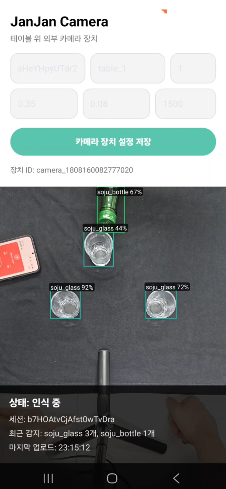
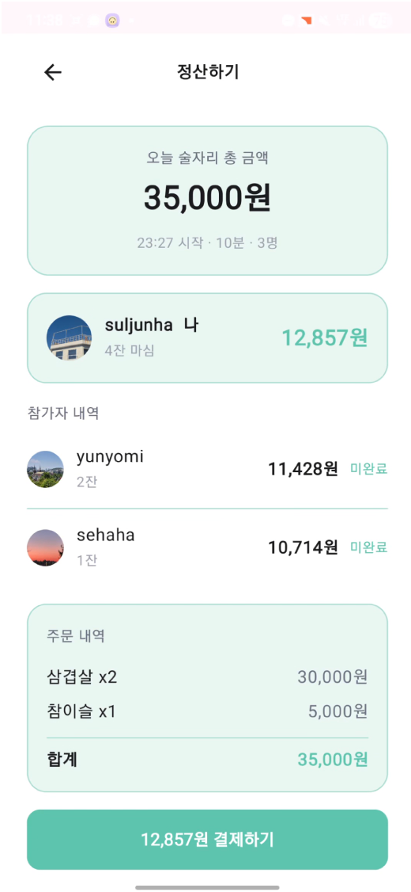

# JanJan

<p align="center">
  
  
  
  
</p>

JanJan은 술자리에서 주문, 잔 매핑, 음주량 기록, 정산까지 한 흐름으로 관리하는 Android 기반 테이블 세션 서비스입니다. 개인 사용자는 QR 또는 초대코드로 테이블에 참여하고, 사업자는 테이블과 메뉴, 카메라 연동, 매출 현황을 관리할 수 있습니다.

## 주요 기능

- 개인 모드
  - QR 스캔 또는 초대코드로 테이블 세션 참여
  - 매장 메뉴 주문 및 주문 내역 확인
  - 사용자별 잔 색상 선택과 실제 잔 매핑
  - 소주/맥주 음주 횟수 실시간 기록
  - KakaoPay, Naver Pay, Toss Pay, 직접 결제 흐름을 포함한 개인별 정산
  - 음주 기록, 캘린더, 친구/매장 랭킹 확인

- 사업자 모드
  - Firebase Auth 기반 사업자 회원가입/로그인
  - 테이블 생성, 삭제, 실시간 상태 관리
  - 메뉴 등록, 수정, 품절 처리, 카테고리 필터링
  - 테이블별 카메라 IP/스트림 URL 매핑
  - 당일 매출, 주간 매출, 메뉴별 매출 통계 확인

- 카메라/CV 모드
  - 별도 `JanJan Camera` 런처로 테이블 카메라 등록
  - CameraX 프레임 분석과 ONNX Runtime 기반 YOLO 모델 실행
  - 병/잔 객체 추적, 잔 색상 매핑, 따르는 동작 감지
  - 감지 결과를 Firestore에 업로드하고 Cloud Functions에서 음주 카운트 반영

## 기술 스택

- Android: Kotlin, XML/ViewBinding, Jetpack Compose, Navigation, CameraX
- AI/CV: ONNX Runtime, YOLO model, ML Kit Barcode Scanning
- Backend: Firebase Auth, Firestore, Storage, Cloud Functions
- Functions: TypeScript, Node.js 20, Firebase Admin SDK
- Network/Image: Retrofit, OkHttp, Glide, Coil
- Build: Gradle Kotlin DSL, Android Gradle Plugin, JDK 21 toolchain

## 프로젝트 구조

```text
app/
  src/main/java/com/gachon/janjan/
    domain/session/     개인 세션, QR, 잔 색상, 랭킹, 기록
    domain/owner/       사업자 테이블/카메라 관리
    domain/camera/      CameraX, YOLO 분석, 감지 결과 업로드
    ui/order/           주문 화면과 장바구니
    ui/settlement/      정산과 결제 방식 선택
    data/               모델과 Repository
  src/main/assets/      ONNX 모델과 라벨 파일
functions/
  src/index.ts          Firestore 트리거와 CV 이벤트 처리
firestore.rules         Firestore 보안 규칙
firestore.indexes.json  Firestore 인덱스 설정
```
